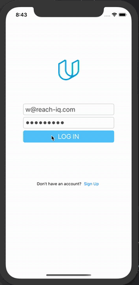

# OnTheMap

FUNCTION:
The app allows you to see the location of all of the students in the iOS nanodegree program on a map.

UI:
Users are presented with a map showing the pinned locations of all users. They can toggle the view to see a table of those usernames along with urls those users might have added
to their pinned location. Apple's MapKit framework (MKMapView, MKMapViewDelegate, MKPointAnnotation) is used to display map functionality. The user interfaces are responsive and 
communicate network activity.

BACKEND:
Access networked data using Apple's URL loading framework. User is authenticated over a network connection. GET, POST and PUT requests are made to read and write from/to Udacity's 
RESTful networked API.

DEMO:

[]

